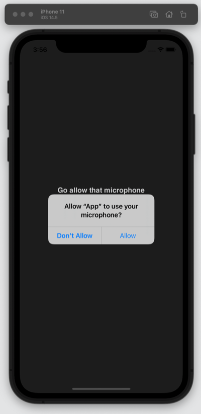
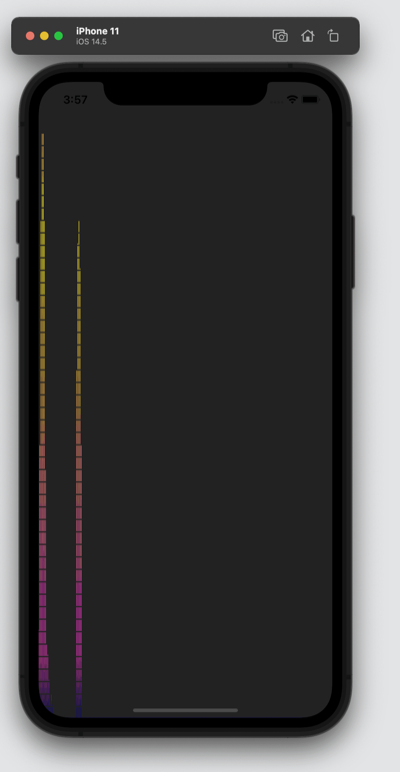

# capacitor-ios-microphone-minimal-working-example

You can get the microphone in ios and safari in capacitor using the browser API, without any plugins

## Usage

```
git clone https://github.com/qpwo/capacitor-ios-microphone-minimal-working-example
cd capacitor-ios-microphone-minimal-working-example
npm install
npx cap init # to set your app name
npx cap add ios
npx cap sync ios
cp Info.plist ios/App/App/Info.plist # or just add the NSMicrophoneUsageDescription key & string
npx cap run ios # choose one of the simulators
# grant microphone permissions etc and you should see a visualization
```

## Screenshots



